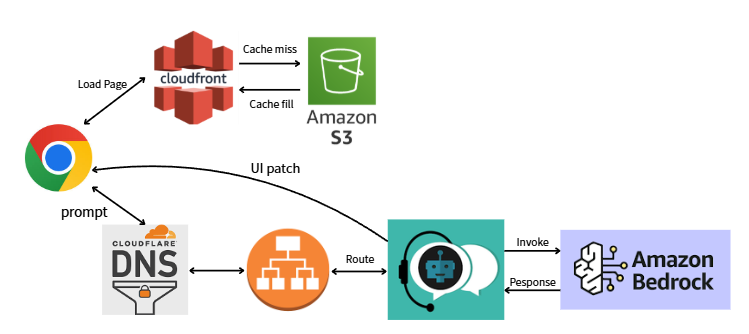
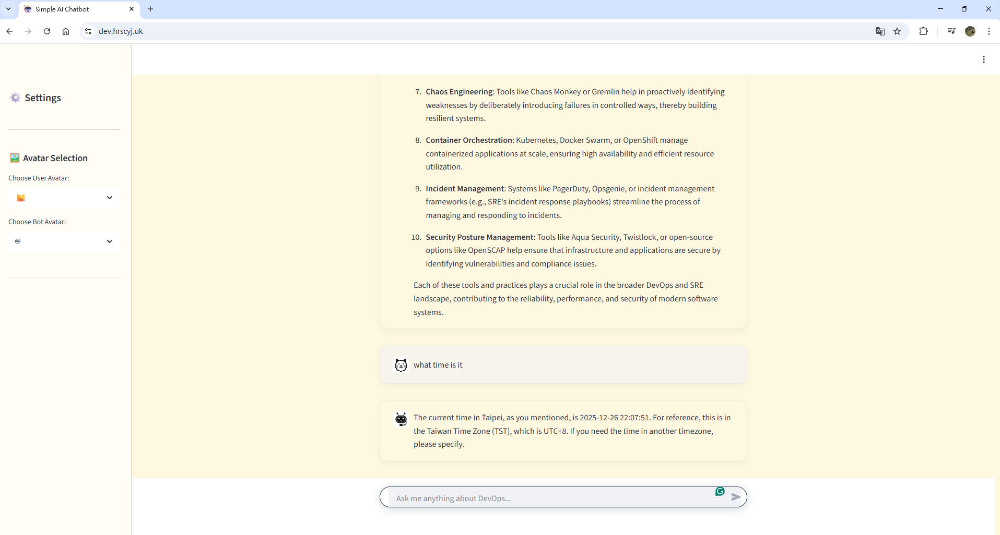
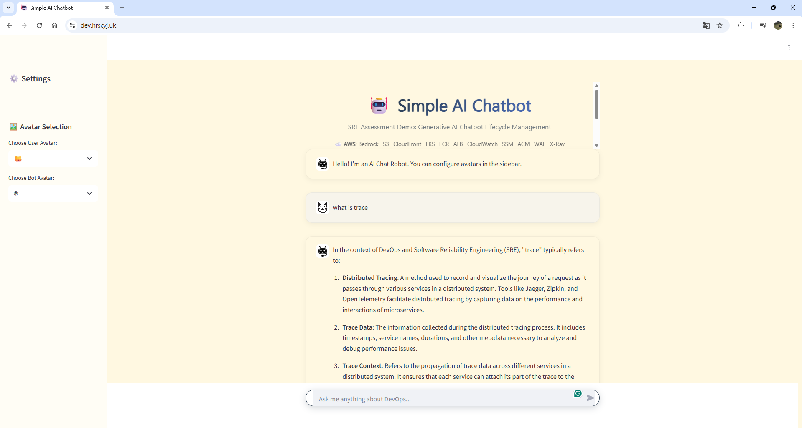
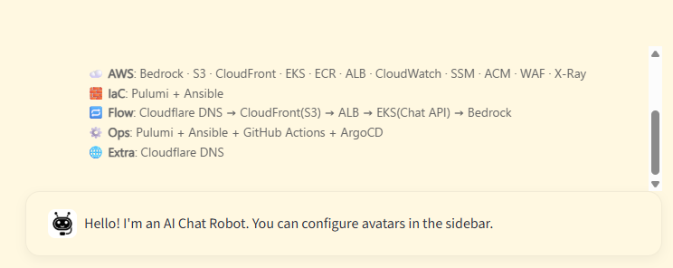
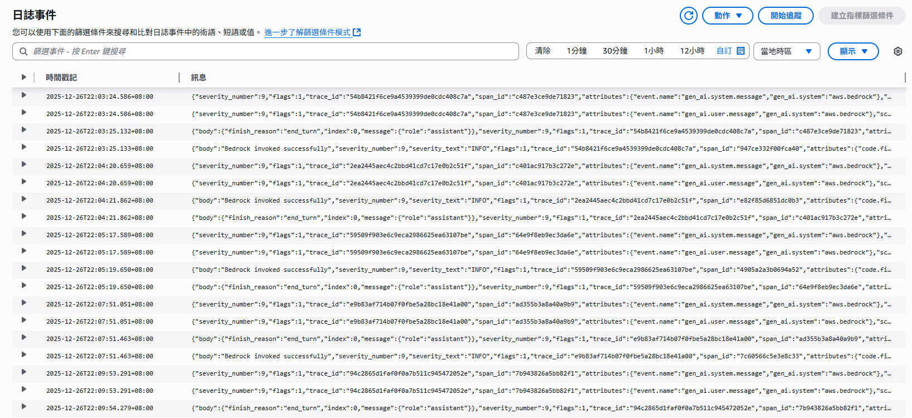
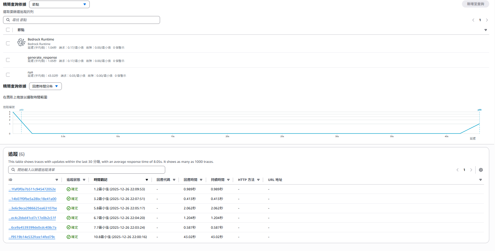
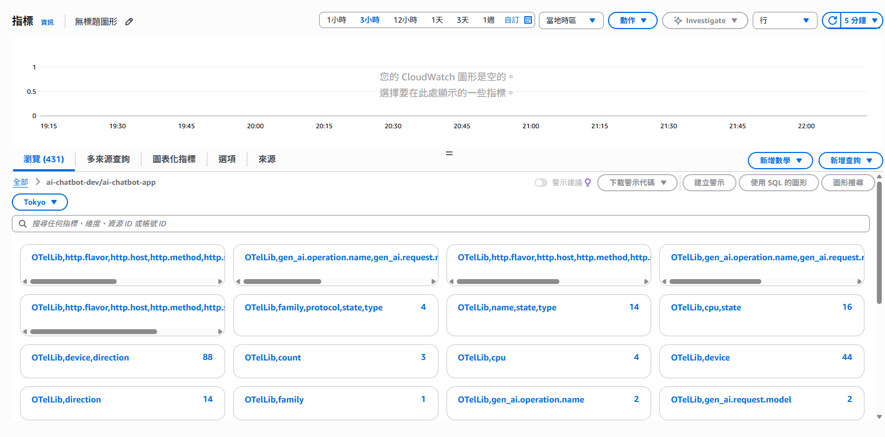
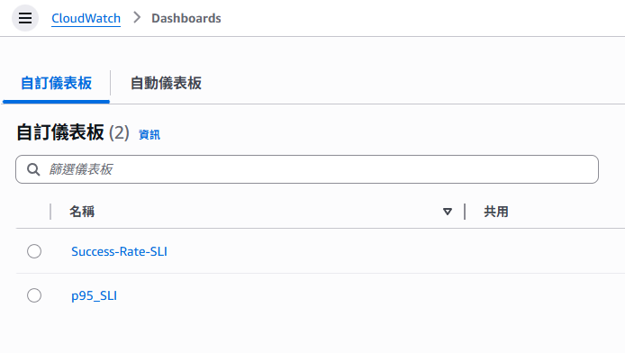
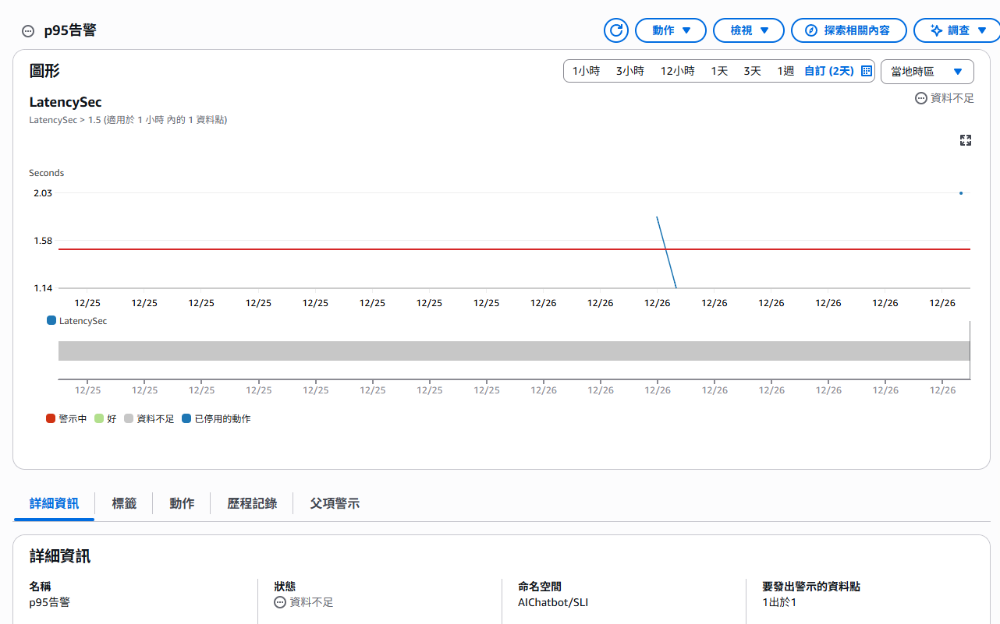
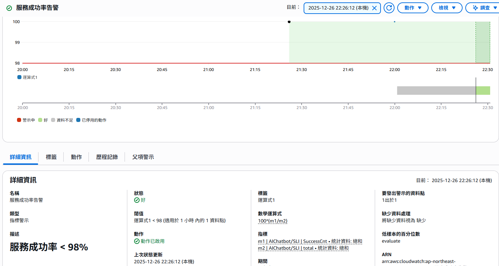

### 使用方式（Deploy / Update / Destroy）

目標：在乾淨的 AWS 帳號上，一鍵完成 EKS 平台 + ECR + Addons + Observability + Chatbot App 的完整生命週期管理。

### 0) 先決條件
####    1. AWS 帳號要建 GitHub OIDC identity provider
####    2. 建一個 IAM Role 給 GitHub Actions AssumeRoleWithWebIdentity
####    3. IAM Role 最小權限 : 
        a. Pulumi 要建的 AWS 資源 API 權限
        b. EKS Cluster 操作權限

### 1) 核心操作流程:
    這個 Repo 的設計哲學是 "CI Driven Infrastructure"。所有的建置與銷毀操作，最標準的方式是透過 GitHub Actions 觸發
####    1. 啟動環境 (Provisioning)
     - 操作方式：
        1. 進入 GitHub Repo 的 Actions 頁面
        2. 選擇左側的 "Platform Lifecycle Management" (可參考.github/workflows/pulumi-build-env.yaml)
        3. 點擊 Run workflow
        4. 在 Action 下拉選單選擇：up 並執行
####    2. 連線與驗證 (Access & Verify)
        1. aws eks update-kubeconfig --name eks-dev --region ap-northeast-1
        2. 建立 Access Entry，綁定 Admin Policy (可修改 Pulumi 程式或透過 AWS CLI 手動寫入)
####    3. 部署應用程式 (Deploy Apps via GitOps)
     - 操作方式：
        1. 進入 GitHub Repo 的 Actions 頁面
        2. 選擇左側的 "Platform Lifecycle Management"
        3. 點擊 Run workflow
        4. 在 Action 下拉選單選擇：artifact 並執行，上傳靜態資源
        5. 在 Action 下拉選單選擇：deploy 並執行，使 ArgoCD 自動同步
        6. 該 App 程式碼後自動 Build Docker Image 推送到 ECR
        7. 修改 K8s 資源時，ArgoCD 偵測到 Git 變更，自動同步到 EKS。
####    4. 銷毀環境
     - 操作方式 :
        1. 進入 GitHub Repo 的 Actions 頁面
        2. 選擇左側的 "Platform Lifecycle Management"
        3. 點擊 Run workflow
        4. 在 Action 下拉選單選擇：destroy 並執行 

### 2) 專案目錄導覽
####    1. ansible/ : 整體流程編排， bootstrap → platform_up → upload_static → destroy
####    2. app/ : Chatbot 服務（Dockerfile、靜態檔案、Streamlit App code）
####    3. infra/ : Pulumi (Python) IaC，負責建立 AWS 雲端資源與 EKS 附加元件
####    4. k8s/ : Kustomize / Manifest
####    5. scripts/ : Chatbot 服務容器化的輔助腳本

### 3) Chatbot 服務架構圖

User (Chrome) ➡️ Cloudflare DNS ➡️ AWS ALB (Ingress) ➡️ [EKS Cluster] -> Service -> Chatbot Pod > ➡️ AWS Bedrock

### 4) 基礎設施 Infra layer
####    1. Amazon EKS
        - 用途 : 核心控制平面，用來託管所有工作負載
####    2. Amazon ECR
        - 用途 : 儲存 Chatbot 服務的 Docker Image
####    3. Amazon VPC
        - 用途 : 建構隔離且安全的網路環境
####    4. ALB
        - 用途：透過 AWS Load Balancer Controller 自動建立，負責把外部流量轉發到EKS Pods。
####    5. Amazon CloudFront
        - 用途 : CDN 服務，用來快取靜態資源（如圖片、CSS、HTML）
####    6. AWS IAM
        - 用途：管理權限
        - OIDC: GitHub Actions 透過 OIDC (OpenID Connect) 取得 AWS 短期憑證
        - IRSA: 讓 EKS 裡的 Pod 擁有專屬的 IAM Role，最小化權限原則
####    7. Amazon S3
        - 用途 : 配合 CloudFront 儲存靜態網頁檔案或 Chatbot 需要的素材
####    8. Amazon Bedrock
        - 用途 : Chatbot 後端的，透過 API 呼叫 Foundation Models (如 Claude 或 Titan)
####    9. AWS SSM
        - 用途：儲存 Pulumi 需傳遞給服務的變數
### 5) EKS 叢集 Platform layer
####    1. 持續交付引擎

        - 核心元件：ArgoCD
            - 用途 : 自動同步、漂移檢測、App of Apps 模式
####    2. 機密管理系統 (Secret Management)
        - 核心元件：External Secrets Operator (ESO) + AWS SSM Parameter Store
        - 用途 : Secret Zero、動態注入
####    3. 流量控制與路由
        - 核心元件：AWS Load Balancer Controller
        - 用途 : 橋接 AWS 資源(Ingress)、Layer 7 路由、SSL 卸載
####    4. 安全與憑證
        - 核心元件 : Cert-Manager
        - 管理叢集內的憑證 (Webhook 驗證用)
####    5. 可觀測性 (Observability)
        - ADOT (AWS Distro for OpenTelemetry)
####    6. Bedrock Integration
        - 使用了 EKS Pod Identity 來調用 Bedrock，比 IRSA 更方便簡潔
### 6) CI/CD : 
    - 本專案採用 "CI 推送 (Push) + CD 拉取 (Pull)" 的混合模式，並結合 GitHub Actions 與 ArgoCD 來實現全自動化的軟體交付流程
    - CI 階段：持續整合 (GitHub Actions)
      - 當開發者將程式碼 Push 到 main 分支時，GitHub Actions 會觸發 Build & Push 流程
    - CD 階段：持續部署 (ArgoCD)
      - Git Repo 中的 Manifest 檔案被 CI 更新，ArgoCD 就會接手
### 7) Observability :
* ADOT (AWS Distro for OpenTelemetry) : 
- ADOT Gateway 模式
在架構中扮演 「遙測數據中轉站 (Telemetry Gateway)」 的角色，最後統一送到 AWS 的三大監控服務 (CloudWatch Logs, Metrics, X-Ray)。
    * Logs (日誌)
Log 透過 OTLP 直接送到 Collector，再轉送到 CloudWatch Logs

    * Traces (分佈式追蹤)

透過 TraceID 和 Span 能畫出「請求路徑圖」

當使用者說「聊天機器人回應很慢」時，你可以去 AWS X-Ray 看服務地圖 (Service Map)

    * Metrics (指標)
ADOT Collector 自動收集與發送系統指標

根據業務品質設置 SLI，此處為 服務成功率 與 延遲程度p95 作為SLI

    * Alarm 告警
透過自訂 SLI 將 Latency 和 Fallback 率設置告警

### 🌟 架構亮點 (Key Highlights for Interview)

 - 應用程式的部署不接觸 CI Server 的憑證，而是由叢集內的 ArgoCD 主動去拉取 (Pull Model)，安全性更高。

 - 無金鑰架構 (Keyless Security)：

 - CI 端：使用 GitHub OIDC。

 - Runtime 端：使用 IRSA (IAM Roles for Service Accounts) 與 Pod Identity。

 - Secret 端：使用 External Secrets Operator 同步 SSM Parameter Store，Git 內完全不存敏感資料。

### 平台工程思維 (Platform Engineering)：

透過 IaC (Pulumi) 與配置管理 (Ansible) 的結合，實現了「一鍵建置平台」的能力，大幅降低了環境重現的難度。

